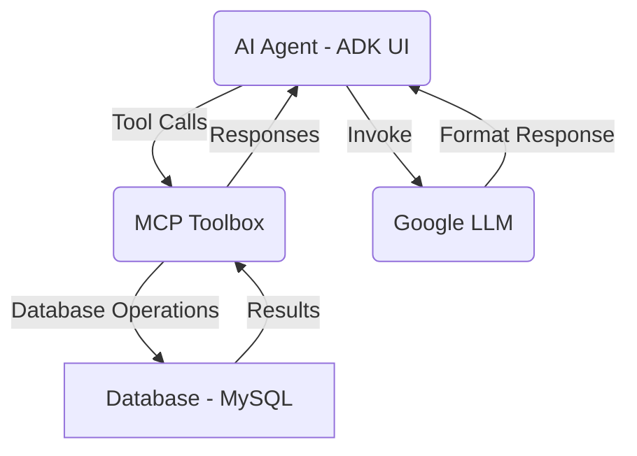

# ai-agent-with-mcp
Google Gemini AI agent communicating with MCP server

## Architecture

```mermaid
%%{config: {look: handDrawn}}%%
graph TD;
    A(AI Agent - ADK UI) -->|Tool Calls| B(MCP Toolbox)
    A --> |Invoke| X(Google LLM)
    B -->|Database Operations| C[Database - MySQL]
    C -->|Results| B
    B -->|Responses| A
    X --> |Format Response| A

```